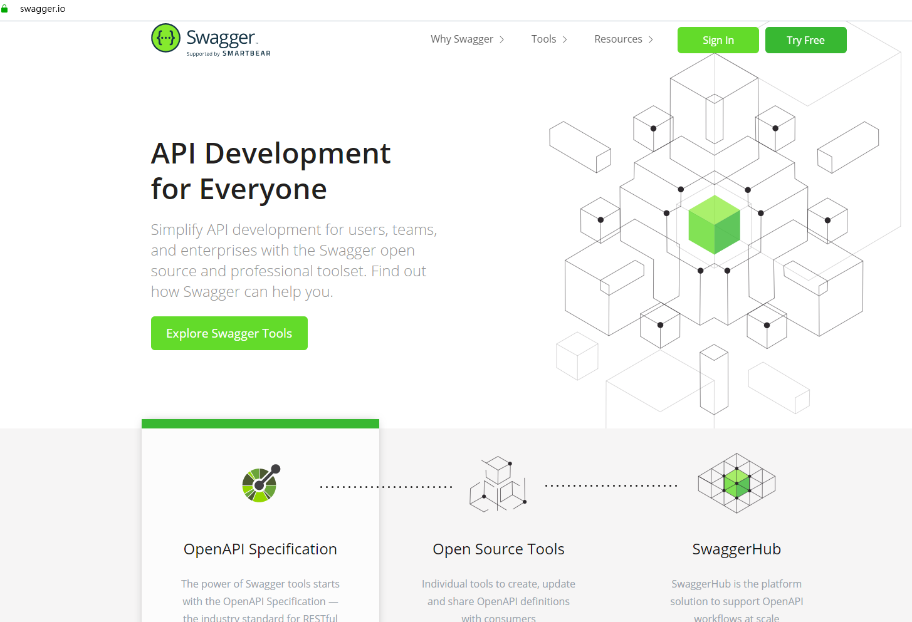
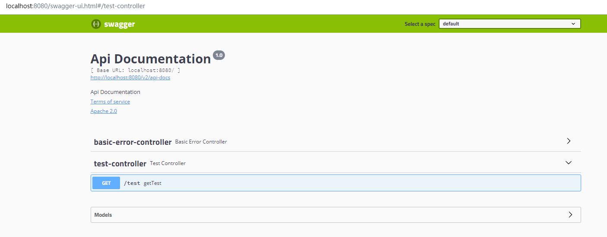
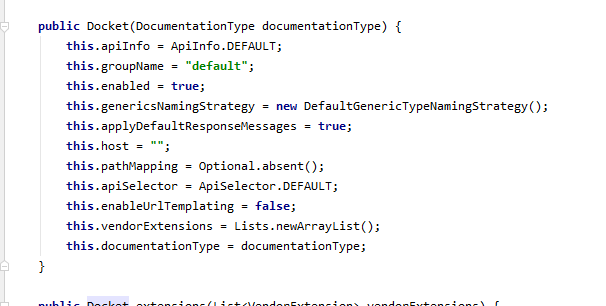
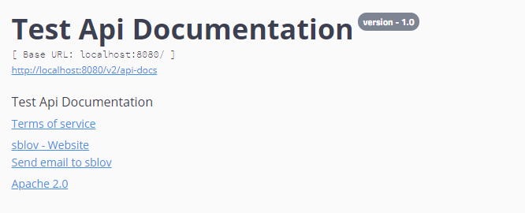
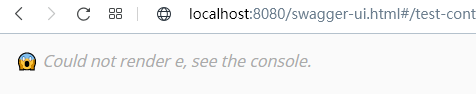
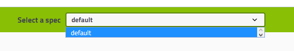
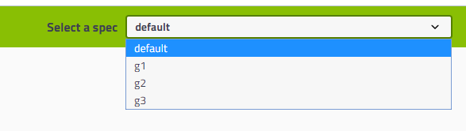

# Swagger

## 有问题先看源码

## Swagger产生

​	由于前后端分离的出现，导致前后接耦为两部分人员进行开发，在开发中，前端从后台获取数据的接口需要经常改变，每次变化时，前后端人员无法马上解决这种协调问题。

​	所有开始会有些api文档说明出现，但这这种文档还是需要人工去维护，后端人员才能及时对API进行修改，才能降低集成的风险；而前端人员每次去测试接口时只能借助第三方工具（==postman==）

​	由此，Swagger这种API框架诞生，该框架能做到

- API文档与API定义同步更新
- 直接在线测试API接口
- 支持多种语言



## SpringBoot集成使用

### maven

```xml
<!-- https://mvnrepository.com/artifact/io.springfox/springfox-swagger2 -->
<dependency>
    <groupId>io.springfox</groupId>
    <artifactId>springfox-swagger2</artifactId>
    <version>2.9.2</version>
</dependency>

<!-- https://mvnrepository.com/artifact/io.springfox/springfox-swagger-ui -->
<dependency>
    <groupId>io.springfox</groupId>
    <artifactId>springfox-swagger-ui</artifactId>
    <version>2.9.2</version>
</dependency>

```

### 开启Swagger

```
@EnableSwagger2
```



### Swagger配置

​	参照Docket的默认配置进行自定义配置



#### 基本信息配置

```java
@Configuration
@EnableSwagger2 // 开启swagger
public class SwaggerConfig {

    @Bean
    public Docket Docket() {

        return new Docket(DocumentationType.SWAGGER_2)
                .apiInfo(apiInfo());

    }

    /**
     * 基本显示信息配置
     * @return apiinfo
     */
    private ApiInfo apiInfo() {
        return new ApiInfo(
                "Test Api Documentation",
                "Test Api Documentation",
                "version - 1.0",
                "http://120.55.165.19:7001",
                new Contact("sblov", "http://120.55.165.19:7001", "sb_lov@sina.com"),
                "Apache 2.0",
                "http://www.apache.org/licenses/LICENSE-2.0",
                new ArrayList());

    }

}
```



#### 扫描接口配置

```java
 @Bean
    public Docket Docket(Environment environment) {

        // 设置环境
        Profiles profile =  Profiles.of("dev", "test");
        // 判断是否在这些环境中
        boolean flag = environment.acceptsProfiles(profile);

        return new Docket(DocumentationType.SWAGGER_2)
                .apiInfo(apiInfo())
                // 通过运行环境判断是否开启Swagger
                .enable(flag?true:false)
                .select()
                // RequestHandlerSelectors 配置扫描接口的方式
//                .apis(RequestHandlerSelectors.basePackage("com.example.swagger2.controller"))
                .apis(RequestHandlerSelectors.withClassAnnotation(RestController.class))
//                .apis(RequestHandlerSelectors.withMethodAnnotation(GetMapping.class))
                // 过滤路径， 只扫描选择路径
                .paths(PathSelectors.ant("/**"))
                .build();

    }
```

关闭swagger



#### 分组配置



对于这种分钟，可以以个人/以模块为单位来管理与查看对应的API文档

多个分组其实就是对应了多个Docket实例

```java
    @Bean
    public Docket Docket1(){
        return new Docket(DocumentationType.SWAGGER_2).groupName("g1");
    }

    @Bean
    public Docket Docket2(){
        return new Docket(DocumentationType.SWAGGER_2).groupName("g2");
    }

    @Bean
    public Docket Docket3(){
        return new Docket(DocumentationType.SWAGGER_2).groupName("g3");
    }
```




#### API注解

​	详看TestController类与User类


## 总结

​	接口注释+在线测试	

​	==正式发布时，出于安全考虑，应关闭Swagger，同时节省内存==